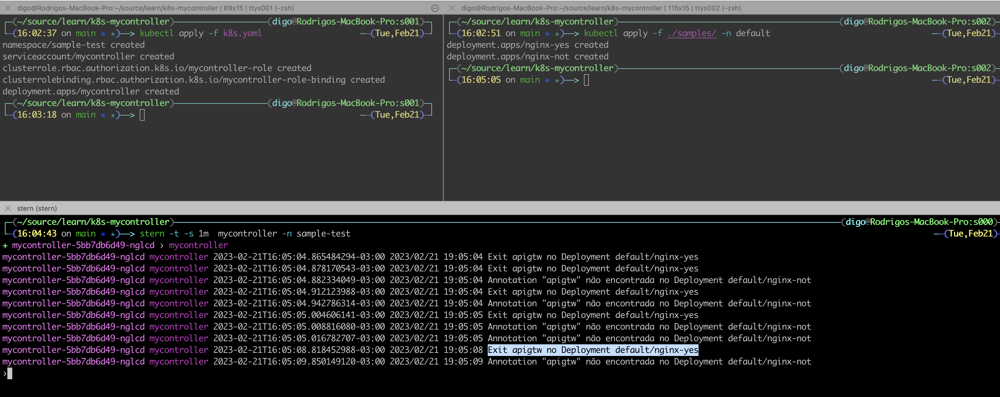

# k8s-mycontroller
Example of using a controller in Kubernetes to validate annotations of deploys when they undergo modifications or creation

### requirements ###
```
GoLang 1.20
Minikube (with docker envs configured)
````

### setup ###
```
mkdir k8s-mycontroller
cd k8s-mycontroller
go mod init digode.dev/mycontroller

# go get
go get k8s.io/api/apps/v1
go get k8s.io/apimachinery/pkg/apis/meta/v1
go get k8s.io/apimachinery/pkg/runtime
go get k8s.io/apimachinery/pkg/watch
go get k8s.io/client-go/kubernetes
go get k8s.io/client-go/rest
go get k8s.io/client-go/tools/cache
go get k8s.io/client-go/util/workqueue

```

### build ###
```
docker build -t mycontroller:v1 .
```

### deploy ###
```
kubectl apply -f ./k8s.yaml -n sample-test
kubectl apply -f ./samples/ -n default
```

### samples ###

```
kubectl apply -f ./samples/ -n default
```




### cleanup ###

```
kubectl delete -f ./samples/ -n default
kubectl apply -f ./k8s.yaml -n sample-test
```